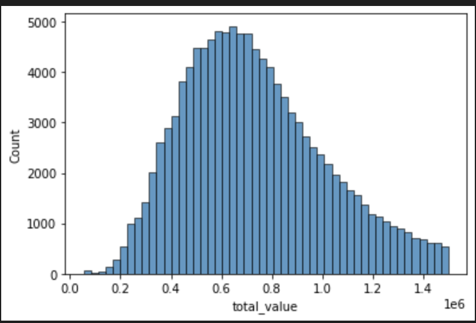
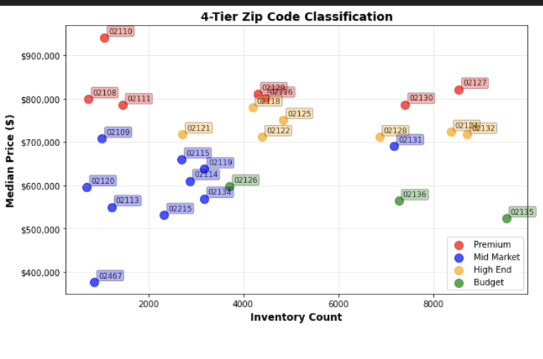
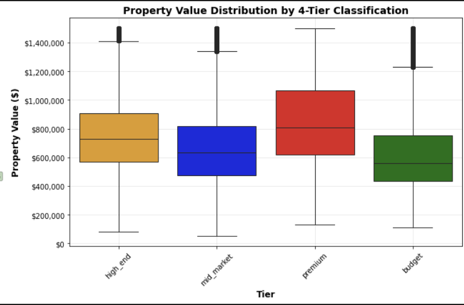
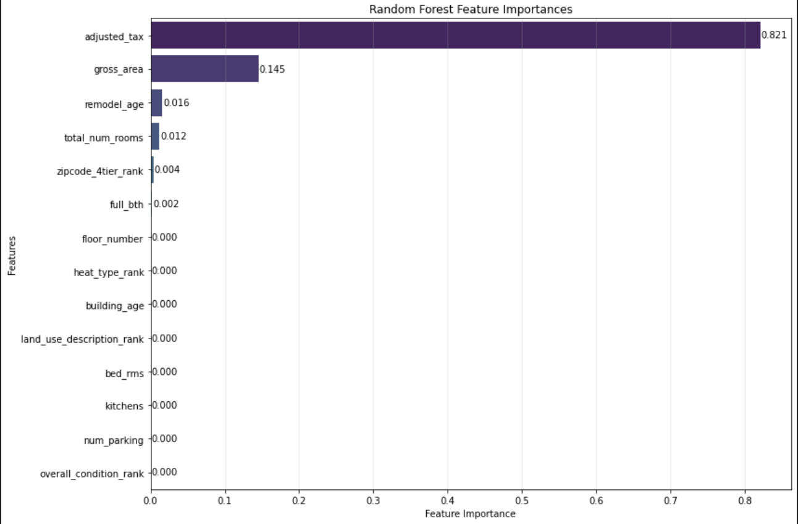
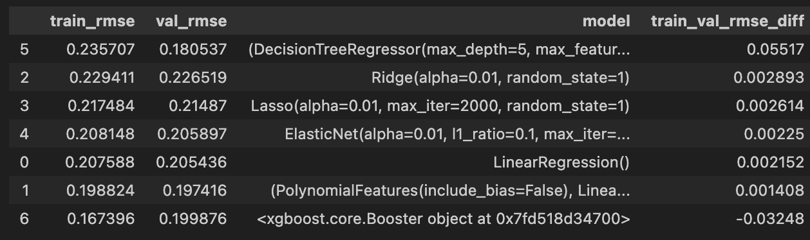
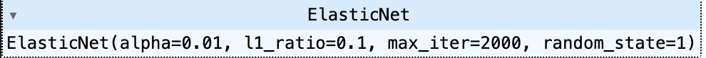

# 🏠 Machine Learning Project Predicting Real Estate Prices for Residents in Boston

[Midterm project](https://github.com/DataTalksClub/machine-learning-zoomcamp/tree/master/projects) for DataTalks.Club Machine Learning ZoomCamp 2025. 

## ⚠️ Problem Statement
The Boston real estate market has become increasingly challenging to navigate, with property prices reaching unprecedented levels and making homeownership a distant dream for many. Whether you're a first-time homebuyer trying to find an affordable entry point or an investor seeking rental income opportunities, understanding what drives property values is crucial for making informed decisions in this competitive market.

The biggest challenge facing potential buyers in Boston is the difficulty of acquiring real estate due to high prices, limited inventory, and rapid market changes. Without clear insights into which property features most significantly impact pricing, buyers often find themselves either overpaying for properties or missing out on undervalued opportunities.

Traditional real estate advice relies heavily on the common mantra of "location, location, location," but in today's data-driven world, we can dig deeper. Property values are influenced by a complex combination of factors including location characteristics (zip code), physical attributes (square footage, number of bedrooms, building age), property condition, and amenities (parking, heating systems, fireplaces).

## 🎯 Goal
This project aims to demystify Boston's residential real estate market by analyzing the 2025 Property Assessment dataset to identify which features have the strongest influence on property values. By leveraging machine learning techniques, we can provide data-driven insights that help both first-time homebuyers and real estate investors make more strategic decisions.

 This is an end-to-end Machine Learning project where the data of our interest is selected, exploratory data analysis as well as cleaning of the data is performed, at least 3 models are trained, the best model is selected, packaged, and deployed to the cloud. 

**Target Audience**:

- First-time homebuyers seeking to understand which property features offer the best value for their budget
- Real estate investors looking to identify undervalued properties with strong rental income potential
- Anyone interested in understanding the Boston residential real estate market dynamics
The ultimate goal is to build a predictive model that can accurately estimate property values based on key features, empowering users to navigate Boston's challenging real estate landscape with confidence and data-backed insights.

## 🗄️ Initial Dataset

> [!CAUTION]
> **🚨 Data Processing Disclaimer**
> 
> **The initial 66-column and 183445-record dataset shown below is NOT used directly for modeling.**
> 
> This project follows a systematic approach:
> 
> 1. **Data Preparation Phase:** ([data_prep.ipynb](https://github.com/eerga/MLZoomcampHW/blob/main/midterm_prep/data_prep.ipynb)): Comprehensive field analysis, feature selection, and data cleaning
> 2. **Feature Engineering and EDA Phase:** ([feature_eng_and_eda.ipynb](https://github.com/eerga/MLZoomcampHW/blob/main/midterm_prep/feature_eng_and_eda.ipynb)): EDA, Feature Engineering, and Further Data Cleaning
> 3. **Modeling Phase:** ([modeling.ipynb](https://github.com/eerga/MLZoomcampHW/blob/main/midterm_prep/modeling.ipynb)): Model Training on the processed dataset. Involves Selection of the Final Model
> 4. **Final Model Training Phase:** ([train.ipynb](https://github.com/eerga/MLZoomcampHW/blob/main/midterm_prep/train.ipynb)) and its script equivalent - ([train.py](https://github.com/eerga/MLZoomcampHW/blob/main/midterm_prep/train.py)): Final Model Training and Saving the [Machine Learning Pipeline](https://github.com/eerga/MLZoomcampHW/blob/main/midterm_prep/model.bin) to the `.bin`
> 5. **Pydantic Schema:** ([pydantic_schema.ipynb](https://github.com/eerga/MLZoomcampHW/blob/main/midterm_prep/pydantic_schema.ipynb)): Getting the information to formulate the Schema for Request and Response of the FastAPI application
> 6. **Prediction Model Phase:** ([predict.ipynb](https://github.com/eerga/MLZoomcampHW/blob/main/midterm_prep/predict.ipynb)) and its script equivalent - ([predict.py](https://github.com/eerga/MLZoomcampHW/blob/main/midterm_prep/predict.py)): Loading the model and Serving it via a web service
> 7. **Dependency Files:** [pyproject.toml](https://github.com/eerga/MLZoomcampHW/blob/main/midterm_prep/pyproject.toml)
> 8. **Packaging the Code:** [Dockerfile](https://github.com/eerga/MLZoomcampHW/blob/main/midterm_prep/Dockerfile) for running the service
> 9. **Local Docker Deployment**: See [🐳 Local Docker Deployment](#-local-docker-deployment) section below for local testing instructions
> 10. **Deployment**: See [☁️ Cloud Deployment](#️-cloud-deployment) section with [video demonstration](https://www.youtube.com/watch?v=-sTecFyrV18)
> 
> Only the most relevant features that align with our problem statement will be selected for the final modeling process.
> 
> --------
> 
> **🔍 For the Detail-Oriented:** If you're curious about the nitty-gritty details of the data cleaning and preparation process, dive into [data_prep.ipynb](https://github.com/eerga/MLZoomcampHW/blob/main/midterm_prep/data_prep.ipynb) for a comprehensive walkthrough.

**Target Variable**: **💰 TOTAL_VALUE**: Total assessed value for property

**Features:** <details>
<summary><strong>📋 Full Dataset Field Descriptions</strong> (Click to expand)</summary>
<br>

📖 **Official Documentation**: [View Complete Field Descriptions](https://data.boston.gov/dataset/property-assessment/resource/96b6cf8b-04f2-4b87-b78f-ba9a0ddd1573)
  <a name="luc-documentation"></a>

📖 **Official Documentation for LUC - Land Use Code**: [View Complete Breakdown of Land of Use Field Descriptions](https://data.boston.gov/dataset/property-assessment/resource/d6c1268c-cd83-4dc3-a914-bba1ed59da6d/view/84f48d02-5d3b-4533-8fb1-459119d0e2d1)

<details>
<summary><strong>🏠 Property Identification</strong></summary>

- **PID**: Unique 10‐digit parcel number. First 2 digits are the ward, digits 3 to 7 are the parcel, and digits 8 to 10 are the sub‐parcel
- **CM_ID**: 10‐digit parcel number of Condo Main, which houses all related condo units
- **GIS_ID**: Primary GIS ID
- **BLDG_SEQ**: Building sequence of parcel
- **NUM_BLDGS**: Total number of buildings of parcel

</details>

<details>
<summary><strong>📍 Location & Address</strong></summary>

- **ST_NUM**: Street number of parcel
- **ST_NAME**: Street name of parcel
- **UNIT_NUM**: Specific unit number within a housing complex
- **CITY**: City or Town of parcel
- **ZIP_CODE**: Zip code of parcel

</details>

<details>
<summary><strong>🏘️ Property Classification</strong></summary>

- **LUC**: Land Use Code
  - *[Detailed Description of Each Code - See Documentation Above](#luc-documentation)*
  - We are going to focus our attention on the Residential Property Only. The full list of the residential codes is:
    - **101**: SINGLE FAM DWELLING
    - **102**: RESIDENTIAL CONDO
    - **103**: MOBILE HOME
    - **104**: TWO-FAM DWELLING
    - **105**: THREE-FAM DWELLING
    - **106**: ADD'L RES IMPROVEMENT
    - **107**: OTHER RESIDENTIAL
    - **108**: CONDO PARKING
    - **109**: MULTIPLE BUILDINGS
    - **110**: CONDO STORAGE

- **LU**: Type of Property (land use)
  - **A**: Residential 7 or more units
  - **AH**: Agricultural/Horticultural
  - **C**: Commercial
  - **CC**: Commercial condominium
  - **CD**: Residential condominium unit
  - **CL**: Commercial land
  - **CM**: Condominium main (physical structure housing all related condo units with no assessed value)
  - **CP**: Condo parking
  - **E**: Tax‐exempt
  - **EA**: Tax‐exempt (121A)
  - **I**: Industrial
  - **R1**: Residential 1‐family
  - **R2**: Residential 2‐family
  - **R3**: Residential 3‐family
  - **R4**: Residential 4 or more family
  - **RC**: Mixed use (residential and commercial)
  - **RL**: Residential land

- **LU_DESC**: Land Use Description

</details>

<details>
<summary><strong>👤 Ownership & Mailing</strong></summary>

- **OWN_OCC**: Residential Exemption: "Y" character code indicating if owner receives residential exemption as an owner‐occupied property
<div style="background-color: #ffebee; border: 2px solid #f44336; border-radius: 5px; padding: 10px; margin: 5px 0;">
<span style="color: #d32f2f; font-weight: bold;">⚠️ PII VIOLATION WARNING:</span> 
<strong>OWNER</strong> field contains personally identifiable information and should NEVER be published publicly or used in modeling.
</div>

- **MAIL_ADDRESSEE**: Care of recipient
- **MAIL_ADDRESS**: Street address where tax bill is mailed
- **MAIL_CITY**: City/neighborhood where tax bill is mailed
- **MAIL_STATE**: State where tax bill is mailed
- **MAIL_ZIP_CODE**: Zip code where tax bill is mailed

</details>

<details>
<summary><strong>📏 Building Size & Layout</strong></summary>

- **RES_FLOOR**: Number of residential building stories
- **CD_FLOOR**: Condominium unit floor number
- **RES_UNITS**: Number of residential units in a condominium building
- **COM_UNITS**: Number of commercial units in a condominium building
- **RC_UNITS**: Number of Residential/Commercial Units in a condominium building
- **LAND_SF**: Parcel's land area in square feet (legal area)
- **GROSS_AREA**: Gross floor area
- **LIVING_AREA**: Living area square footage of the property

</details>

<details>
<summary><strong>💰 Property Values & Taxes</strong></summary>

- **LAND_VALUE**: Total assessed land value
- **BLDG_VALUE**: Total assessed building value
- **GROSS_TAX**: Tax bill amount based on total assessed value multiplied by the tax rate per thousand

</details>

<details>
<summary><strong>🏗️ Building Characteristics & Age</strong></summary>

- **BLDG_TYPE**: Building Type and Style
- **YR_BUILT**: Year property was built
- **YR_REMODEL**: Year property was last remodeled
- **STRUCTURE_CL**: Structural classification of building
  - **A**: Struct Steel
  - **B**: Reinforced Concrete
  - **C**: Brick/Concrete
  - **D**: Wood/Frame
  - **E**: Metal
  - **R**: Residential

</details>

<details>
<summary><strong>🏠 Exterior Features</strong></summary>

- **ROOF_STRUCTURE**: Roof Structure Types
  - **F**: Flat
  - **G**: Gable
  - **H**: Hip
  - **L**: Gambrel
  - **M**: Mansard
  - **O**: Other
  - **S**: Shed

- **ROOF_COVER**: Roof Cover Material
  - **A**: Asphalt Shingle
  - **C**: Composition
  - **O**: Other
  - **R**: Rubber Roof
  - **S**: Slate
  - **T**: Tile
  - **W**: Wood Shingle

- **EXT_FINISHED**: Exterior Siding Material

</details>

<details>
<summary><strong>🔧 Property Condition</strong></summary>

- **INT_WALL**: Interior Wall Condition‐Residential
- **INT_COND**: Interior Condition of parcel‐Residential
- **EXT_COND**: Exterior Condition of parcel
- **OVERALL_COND**: Overall condition of parcel
- **BDRM_COND**: Bedroom Condition‐Residential

</details>

<details>
<summary><strong>🛏️ Rooms & Living Spaces</strong></summary>

- **BED_RMS**: Total number of bedrooms‐Residential
- **FULL_BTH**: Total number of full baths‐Residential
- **HALF_BTH**: Total number of half baths‐Residential
- **KITCHEN**: Total number of kitchens‐Residential
- **TT_RMS**: Total number of rooms‐Residential

</details>

<details>
<summary><strong>🚿 Bathroom Details</strong></summary>

- **BTHRM_STYLE1**: Residential bath style ‐bathroom #1
- **BTHRM_STYLE2**: Residential bath style ‐bathroom #2
- **BTHRM_STYLE3**: Residential bath style ‐ bathroom #3

</details>

<details>
<summary><strong>🍳 Kitchen Details</strong></summary>

- **KITCHEN_TYPE**: Kitchen Type ‐ Residential
- **KITCHEN_STYLE1**: Residential kitchen style –kitchen #1
- **KITCHEN_STYLE2**: Residential kitchen style – kitchen #2
- **KITCHEN_STYLE3**: Residential kitchen style –kitchen #3

</details>

<details>
<summary><strong>🌡️ Heating & Cooling Systems</strong></summary>

- **HEAT_TYPE**: Heating type
- **HEAT_SYSTEM**: Heating System (individually controlled, common or self‐contained)
- **AC_TYPE**: Air Conditioning Type‐Residential

</details>

<details>
<summary><strong>⭐ Amenities & Special Features</strong></summary>

- **FIRE_PLACE**: Total number of fireplaces
- **NUM_PARKING**: Number of parking spaces
- **PROP_VIEW**: Property View
- **ORIENTATION**: Indicates the location a condominium unit in the building is facing
- **CORNER_UNIT**: Indicates if the unit is locating in the corner of the building (Y/N)

</details>
</details>

## 🧹 Cleaned Data
**The cleaned data** - [cleaned_property_data.csv](https://github.com/eerga/MLZoomcampHW/blob/main/midterm_prep/cleaned_property_data.csv) - contains 113931 records and 20 columns and is **used for modeling**. Out of 20 columns, we have:

**Target Variable**: **💰 total_value**: Total assessed value for property

**Features:**
`zip_code`: Zip code of parcel (string representation)
`owner_occupied`: Residential Exemption: 1 indicates that the owner receives residential exemption as an owner‐occupied property
`gross_area`: Gross floor area
`bed_rms`: Total number of bedrooms‐Residential
`full_bth`: Total number of full baths‐Residential
`half_bth`: Total number of half baths‐Residential
`kitchens`: Total number of kitchens‐Residential
`total_num_rooms`: Total number of rooms‐Residential
`fireplaces`: Total number of fireplaces
`num_parking`: : Number of parking spaces

**Engineered Features**
`floor_number`: The max value between 
- **RES_FLOOR**: Number of residential building stories
- **CD_FLOOR**: Condominium unit floor number
- Typically, whichever floor is max is the one that the residential unit is standing on. 

`building_age`: 2025 - yr_built
`remodel_age`: 2025 - `yr_remodel`. If `yr_remodel` field is missing, fill it in with `yr_built` and do the math. 
`ac_type_rank` - derived from `ac_type` (Air Conditioning Type‐Residential) field. The following mapping is used to convert string to numeric representation: 
```python
ac_mapping = {
    'n_none': 0,
    'c_central_ac': 1,
    'd_ductless_ac': 2, 
}
```

`overall_condition_rank` - derived from `overall_cond` (Overall condition of parcel). The following mapping is used to convert string to numeric representation: 
```python
condition_ranking = {
    'p_poor': 1,          # Worst
    'f_fair': 2,          
    'a_average': 3,       # Middle
    'g_good': 4,          
    'vg_very_good': 5,    
    'e_excellent': 6,     # Best
    'ex_excellent': 6     # Same as 'E - Excellent' (duplicate)
}
```
`heat_type_rank` - derived from `heat_type` (Heating type). The following mapping is used to convert string to numeric representation: 
```python
heat_type_ranking = {
    'n_none': 0,              # Worst - no heating system
    'o_other': 1,             # Unknown quality
    's_space_heat': 2,        # Poor - inefficient, uneven heating
    'e_electric': 3,          # Expensive to operate, but reliable
    'p_heat_pump': 4,         # Energy efficient, modern
    'f_forced_hot_air': 5,    # Common, efficient, good distribution
    'w_ht_water/steam': 6     # Best - even heat, comfortable, efficient
}
```
`land_use_description_rank`- derived from `land_use_description` (Heating type). The following mapping is used to convert string to numeric representation: 
```python
property_type_ranking = {
    'residential_condo': 1,
    'single_fam_dwelling': 2, 
    'two_fam_dwelling': 3, 
    'three_fam_dwelling': 4,     
}
```
based on the average price by each type of land use description

`zipcode_4tier_rank`- derived from 2 items - `zip_code` and `zipcode_4tier` (Classifying zip codes into 4 tiers based on price - the lower, the avg price, the lower the tier and inventory - the higher the inventory, the lower the tier.)
```python
zipcode_mapping = {
    'budget': 1,
    'mid_market': 2,
    'high_end': 3,
    'premium': 4
}
```
`adjusted_tax`: if owner_occupied == 1, then we substract $3984.21 from the gross tax.

## 📊 EDA


Distribution of the target variable to see if the models would perform well. Since we are focusing the first-time homebuyers, we capped the price at $1.5 million dollars. 

<br>



Indicates the quadrant where the inventory count is high and the median price is relatively low so that there is less of competition for the house / condominium. 

  

I tried to divide the properties by zipcode and bin the list of the zip codes into a category. However, it is possible to see that the outliers in 3 categories - `high_end`, `mid_market`, and `budget` are way too high, making it quite hard to determine which house belongs to which category. After some time, I've realized that we should have incorporated the overall condition as well in the average prices by zipcodes statistics, but that was enough of feature engieering for the night. 

## 🤖 Model training


Indicates that adjusted tax was the most influential predictive features for tree models. The same variables was the most influential for linear models.



Shows breakdown of the train RMSE and validation RMSE. The reason why they are so small is because I did a logarithmic transformation on the target value (`total_value`) because it was so much higher compared to the rest of the features. 

The way that the model was chosen is basically to where the difference between the train and validation RSME's was small enough. The most frequent was 0.002 difference, so I went with one of those models. 

Again, this project is not focused on having the absolute best model. We are doing everything we can. 


`ElasticNet` was the model of my selection with the listed parameters. 

### 🐳 Local Docker Deployment

> [TIP]
> **Prerequisites**: Ensure Docker is installed and running on your machine

📥 **Step 1: Get the Code**

Clone the repository
```bash
# Clone the repository
git clone https://github.com/eerga/MLZoomcampHW.git

# Navigate to project directory
cd MLZoomcampHW/midterm_prep
```

✅ **Step 2: Verify Docker Installation**
> [!NOTE] If the above command runs successfully, you're ready to proceed!

```sh
docker run hello-world
```

🔨 **Step 3: Build the Docker Image**
```sh
# Build the prediction API image
docker build --no-cache -t real-estate-prediction .
```

🚀 **Step 4: Run the Container**
```sh
# Start the API server
docker run -it --rm -p 9696:9696 real-estate-prediction
```

🧪 Step 5: Test Your API
🌐 Open your browser and navigate to: http://localhost:9696/docs
📄 Click "Try it out" in the FastAPI documentation interface
📋 Copy and paste the content from [re_property.json](https://github.com/eerga/MLZoomcampHW/blob/main/midterm_prep/re_property.json)
▶️ Click "Execute" to get your prediction
Expected reponse:

```python
{
  "predicted_value": 807383.14
}
```

**Option B: Automated Testing Script**

```python 
python marketing.py
```
🧹 **Step 6: Clean Up**

```sh
# Stop all running containers when finished
docker stop $(docker ps -q)

# Optional: Remove the image to free up space
docker rmi real-estate-prediction
```

>[!WARNING] Port Conflicts: If port 9696 is already in use, try: docker run -it --rm -p 9697:9696 real-estate-prediction and access via http://localhost:9697

### ☁️ Cloud deployment

> [!NOTE]
> **Video Proof Available**: This deployment was successfully completed and documented. No need to run these commands yourself! Click on the [video proof](https://www.youtube.com/watch?v=-sTecFyrV18) to see the deployment video.

🚀 **Step 1: Install Fly.io CLI**

```bash
# Download and install Fly.io CLI
curl -L https://fly.io/install.sh | sh
```

⚙️ **Step 2: Edit shell configuration (works for Mac)**

Open the bash shell
```sh
nano ~/.zshrc
```
Export environment variables 
```sh
export FLYCTL_INSTALL="{directory}/.fly"
export PATH="$FLYCTL_INSTALL/bin:$PATH"
```
Reload the shell to update its status:

```sh
`source ~/.zshrc
```
✅ **Step 3: Verify Installation**
```sh
which fly
```

🔐 **Step 4: Authentication & Setup**
```sh
# Sign up and authenticate with Fly.io
fly auth signup
```

```sh
# Launch your app with auto-generated name
fly launch --generate-name
```

**[!TIP] Interactive Setup Questions**:
❌ N - No, I don't want to tweak the settings
✅ Y - Yes, create a Dockerfile

🚀 **Step 5: Deploy Your Application**
Check that Docker ignore was created

```fly deploy```

🎯 **Step 6: Test Your Deployment**
1. 📋 Get your deployment URL from the fly deploy output
2. 🌐 Navigate to [your-app-url]/docs
3. 🧪 Click "Try it out" in the FastAPI documentation
4. 📄 Copy-paste your re_property.json test data
5. 🎉 Expected Response:
```python
{
  "predicted_value": 807383.14
}
```
🧪 **Step 7: Test with Custom Script**
```python
# Update marketing.py with your deployment URL
python marketing.py
```

🧹 **Step 8: Clean Up (Optional)**

```sh
# List all your fly apps
fly apps list
```

Detroy the app
```sh
fly apps destroy <app-name>
```
